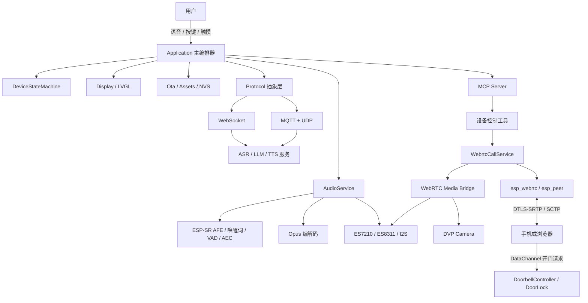

# intelligent_audio_box

> 基于 **ESP32-S3** 的智能音箱固件:离线唤醒 + 云端语音助手,并集成一条可独立启停的 **WebRTC 点对点实时通话** 链路与实验性 **门铃 / 远程开门** 控制。

面向岗位:嵌入式软件工程师 / 物联网开发 / 智能硬件 / 音视频实时通信。

---

## 项目简介

设备以离线唤醒词为入口,通过流式 ASR、LLM 与 TTS 完成语音交互,并通过 MCP 向大模型暴露受控的设备能力。在此基础上,项目把一套**浏览器 ↔ 设备的 WebRTC 实时通话**集成进同一块资源受限的 ESP32-S3:通话与语音助手复用同一组麦克风、扬声器与摄像头,支持设备端通话 AEC、无摄像头自动降级,以及基于 DataChannel 的远程门锁控制。

项目重点不只是“把 WebRTC 跑起来”,而是处理资源受限设备上更实际的工程问题:音频外设的资源独占与移交、TTS 播放中的可靠人声打断、设备端回声消除、远程物理控制的安全边界,以及 16 MB Flash 上的双分区 OTA。

> 详细的架构 / 状态机 / 难点与验证边界说明见 [`项目介绍.md`](项目介绍.md)。

---

## 核心特性

### 🎙 智能语音助手
- ESP-SR 离线唤醒词 + 本地 AFE 处理
- WebSocket 或 MQTT + UDP 云端语音会话,上行 Opus / 下行 TTS
- 支持自动停止、手动停止与实时监听三种会话模式
- 支持设备端 / 服务端 / 关闭 AEC,并在协议握手时声明能力
- MCP(Model Context Protocol)将设备控制注册为大模型可调用工具
- NVS 配置持久化、设备激活、资源更新与双分区 OTA

### ⚡ TTS 自由打断
- `Speaking` 状态下仅运行 AEC + VAD,关闭上行编码
- 首次检测到人声后延迟二次确认,过滤瞬时噪声与扬声器残余回声
- 确认后中止服务端 TTS、清空本地缓存并切回监听
- 无可靠播放参考通道的板卡自动回退到唤醒词打断

### 📞 WebRTC 实时通话
- 浏览器 / 手机与设备点对点媒体直连(`esp_webrtc`),不经媒体服务器转发
- 音频:G711A/PCMA **8 kHz 单声道全双工**
- 视频:H.264 320×240、15 fps **单向上行**(带摄像头板型;无摄像头板自动降级为纯音频)
- 通话期设备端 AEC:ES7210 **MMR 硬件参考** 布局(两路近端麦克风 + 一路播放回采)
- 关闭引擎自动重连,对端离线由应用层统一清理资源并恢复语音助手
- 提供建连阶段耗时、通话时长与结束原因等状态统计

### 🔔 门铃与远程开门(实验性)
- LVGL 门铃页面:呼叫、开门提示、房间号设置
- **开门命令只接受已建连 WebRTC 的 DataChannel 消息**,信令通道的开门请求直接丢弃
- `request_id` 关联请求与应答;浏览器超时只提示“结果未知”,不自动重发物理动作
- 定长 GPIO 脉冲执行器(默认 GPIO21、800 ms),不暴露任意 GPIO 写接口
- ⚠️ 门锁 GPIO 仅输出逻辑控制信号,实际驱动需要继电器 / MOSFET 等外部电路

---

## 硬件平台

| 能力 | 立创 ESP32-S3 开发板 | ESP-BOX-3 |
| --- | --- | --- |
| 显示 | 320×240 ST7789 LCD + FT5x06 触摸 | 320×240 ILI9341 LCD |
| 音频 | ES8311 播放 + ES7210 多通道采集 | ES8311 播放 + ES7210 多通道采集 |
| 摄像头 | DVP 摄像头(QVGA RGB565) | 无(WebRTC 自动降级纯音频) |
| 助手音频 | 24 kHz | 24 kHz |
| WebRTC 音频 | G711A 8 kHz 单声道全双工 | 同左 |
| WebRTC 视频 | H.264 320×240 15 fps 仅上行 | 不启用 |
| 门锁 | GPIO21 输出 800 ms 高电平脉冲 | 安全地不可用 |

均使用 **16 MB Flash + PSRAM**,默认音频采样率 24 kHz。

---

## 架构概览



### 并发设计要点

- **主任务并发模型**:网络 / 音频 / 定时器 / WebRTC 回调运行在不同 FreeRTOS 任务中,通过事件组(无参高频通知)与闭包队列(带数据、逐项执行)把工作交还主任务串行处理。
- **原语分工**:FreeRTOS 事件组 / 任务通知只负责事件通知与 ISR 唤醒;大数据传递用 `std::deque` + `std::unique_ptr`,互斥用 `std::mutex`,轻量状态用 32 位 `std::atomic`。
- **任务分层**:`audio_input` 优先级最高并固定核心 0;Opus 等计算密集任务放低优先级;`encode_wake_word` 等大栈任务静态创建且栈放 PSRAM。
- 完整任务清单与并发原语说明见 [`RTOS任务.md`](RTOS任务.md)。

---

## 快速开始

### 环境要求
- ESP-IDF `>= 5.5.2`(推荐 5.5.x)
- ESP32-S3 开发板(16 MB Flash + PSRAM)
- Python 3

### 构建与烧录
```bash
idf.py set-target esp32s3
idf.py menuconfig      # 选择板型,并按需开启功能
idf.py build
idf.py flash monitor
```

关键 Kconfig 开关:

| 选项 | 默认 | 说明 |
| --- | --- | --- |
| `USE_WEBRTC_CALL` | `n` | WebRTC 总开关(需 ESP32-S3 + PSRAM) |
| `WEBRTC_SIGNALING_APPRTC_WS` | `y` | 外部 AppRTC 兼容信令(WebSocket) |
| `WEBRTC_SIGNALING_LOCAL_HTTP` | `n` | 设备侧本地 HTTPS 信令 |
| `WEBRTC_CALL_ENABLE_VIDEO` | `y` | 视频上行,无摄像头自动降级 |
| `WEBRTC_DOORBELL_MODE` | `n` | 门铃 UI 与远程开门 |
| `ENABLE_VAD_BARGE_IN` | `y` | TTS 播放期间 AEC + VAD 自由打断 |
| `VAD_BARGE_IN_CONFIRM_MS` | `200` | 打断确认时间(ms) |

> 使用 **本地 HTTPS 信令** 时,需自行生成自签证书放入
> `main/webrtc/signaling/http_local/certs/`(`servercert.pem`、`prvtkey.pem`,已排除出版本库),
> 生成方法见该目录下 [`README.md`](main/webrtc/signaling/http_local/certs/README.md)。

### 两种信令方式
| 模式 | 连接 | 适用场景 |
| --- | --- | --- |
| 外部 AppRTC WebSocket | 设备与浏览器加入同一房间 | 跨网络演示与远程连接 |
| 设备本地 HTTPS | 浏览器访问设备内置调试页,SSE/POST 交换信令 | 受控局域网开发调试 |

浏览器端页面:`web/doorbell/`(外部模式,原生 ES 模块);本地模式使用固件内嵌的 `main/webrtc/signaling/http_local/webrtc_test.html`。

---

## 项目来源与个人贡献

本项目在开源 ESP32 语音助手基座之上改造,WebRTC 底层采用 Espressif 组件(`esp_webrtc` / `esp_peer` / `esp_capture` / `av_render` 等,仓库内 vendored 于 `esp-webrtc/`,仅在功能开启时条件化引入依赖图)。

**本项目的核心改造集中在系统集成与资源管理:**

- WebRTC 通话服务 / 媒体桥 / 通话状态机 / MCP 通话与门铃工具 / 双信令接入
- 音频生命周期改造:复用既有 `esp_codec_dev` 句柄、助手与通话的 Suspend/Resume 移交、MMR 硬件参考 AEC、G711A 8 kHz 双工切换
- 门铃 UI、DataChannel 远程开门协议与门锁执行器
- 并发改造:主任务事件串行化、状态机副作用集中处理、TTS 期间 AEC + VAD 延迟确认打断
- 工程治理:双板收敛、条件化依赖、16 MB Flash 双 OTA 分区重排

---

## 目录结构

```text
intelligent_audio_box/
├── main/
│   ├── main.cc / application.*       # 入口与整机编排、主事件循环
│   ├── device_state_machine.*        # 语音助手全局状态机
│   ├── audio/                        # codec / AFE / 唤醒词 / AEC / VAD / Opus / 音频任务
│   ├── protocols/                    # WebSocket 与 MQTT + UDP 语音协议
│   ├── display/                      # LVGL 9 / LCD / 表情动画
│   ├── boards/                       # esp-box-3 与 lichuang-dev 板级实现
│   ├── webrtc/
│   │   ├── webrtc_call_service.*     # 通话生命周期、状态机与统计
│   │   ├── webrtc_media_bridge.*     # codec / esp_capture / av_render / 摄像头桥
│   │   ├── webrtc_mcp_tools.*        # 通话与门铃 MCP 工具
│   │   ├── signaling/http_local/     # 设备本地 HTTPS 信令 + 内置调试页
│   │   └── doorbell/                 # 门铃 UI / 控制器 / 门锁执行器
│   ├── mcp_server.* / ota.* / settings.* / assets.*
│   └── Kconfig.projbuild             # 板型与功能开关
├── esp-webrtc/                       # Espressif WebRTC 组件(vendored,条件引入)
├── web/doorbell/                     # 浏览器端 ES 模块应用(外部 AppRTC 信令模式)
├── partitions/v2/16m.csv             # 16 MB Flash 双 OTA + 资源分区
├── docs/                             # 设计与方案文档
├── RTOS任务.md                       # FreeRTOS 任务清单与并发原语说明
└── 项目介绍.md                       # 完整设计文档与验证边界
```

---

## 文档
- [`项目介绍.md`](项目介绍.md) — 完整设计:整体/媒体链路架构、状态机、技术难点、验证事实边界
- [`RTOS任务.md`](RTOS任务.md) — FreeRTOS 任务清单、优先级与并发原语分工
- [`docs/webrtc-aec_zh.md`](docs/webrtc-aec_zh.md) — WebRTC 通话期设备端 AEC 方案(ES7210 MMR 硬件参考)

---

## 当前状态与待办

> 遵循“区分源码完成 / 编译通过 / 实机跑通 / 量化验证”的陈述原则,不填没有实测依据的指标。

**历史实机记录**:本地信令下浏览器与设备双向音频、设备摄像头视频上行曾跑通;ESP-BOX-3 可降级纯音频;通话结束后语音助手能恢复。

**当前工作区状态**:
- ✅ 浏览器端 `web/doorbell/js/*.js` 通过 `node --check`
- ✅ `sdkconfig` 已核对(立创板 / 16 MB / 本地 HTTPS 信令 / 视频 / 门铃 / 自由打断)
- ⚠️ `main/CMakeLists.txt` 仍引用两个已移除的资源/语言生成脚本,当前工作区暂未完成干净构建;修复后需对 WebRTC 开/关两套配置做完整编译回归
- ⚠️ TTS 自由打断、任务退出确认等改动尚未完成当前版本实机回归
- ⚠️ AEC 收敛效果、建连延迟等尚无可靠量化实测数据
- ⚠️ 本地 HTTPS 信令暂未鉴权,仅适合受控局域网开发演示,不可作为生产门禁方案

**规划**:补齐媒体桥失败回滚与完整释放、本地信令鉴权(短时配对码 + HttpOnly Cookie)、敏感日志收敛、以及两板 × 多状态(默认 / 通话音频 / 视频 / 门铃)的构建烧录矩阵。
