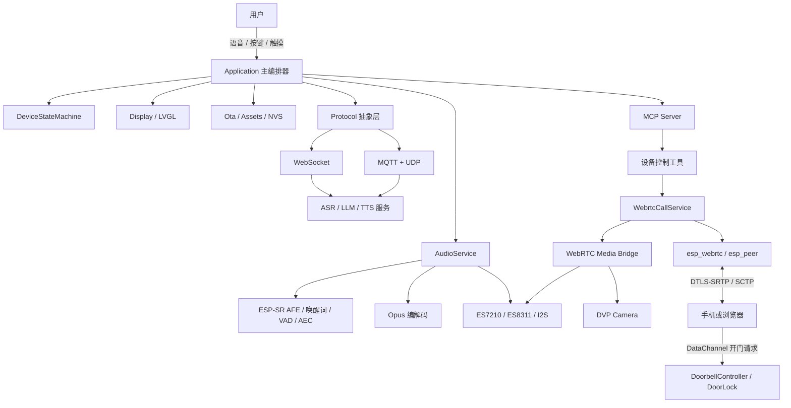

# intelligent_audio_box

> 基于 **ESP32-S3** 的智能音箱固件:离线唤醒 + 云端语音助手,集成可独立启停的 **WebRTC 点对点实时通话**链路与实验性 **门铃 / 远程开门** 控制。

面向岗位:嵌入式软件工程师 / 物联网开发 / 智能硬件 / 音视频实时通信。

## 项目概述

设备以离线唤醒词为入口,通过流式 ASR、LLM 与 TTS 完成语音交互,并通过 MCP 向大模型暴露受控的设备能力。在此基础上,项目把一套**浏览器 ↔ 设备的 WebRTC 实时通话**集成进同一块资源受限的 ESP32-S3:通话与语音助手复用同一组麦克风、扬声器与摄像头,支持设备端通话 AEC、无摄像头自动降级,以及基于 DataChannel 的远程门锁控制。

项目重点不只是“把 WebRTC 跑起来”,而是处理资源受限设备上更实际的工程问题:音频外设的资源独占与移交、TTS 播放中的可靠人声打断、设备端回声消除、远程物理控制的安全边界,以及 16 MB Flash 上的双分区 OTA。

> 完整设计(架构、状态机、难点与验证边界)见 [`项目介绍.md`](项目介绍.md)。

---

## 主要工作

### RTOS 开发:任务调度与并发原语

- 基于 FreeRTOS 划分约 14 个任务(GUI/显示、音频采集与播放、唤醒词检测、AEC/VAD、Opus 编解码、网络协议、信令、配网、OTA 与系统管理),按实时性分为 8 / 5 / 4 / 3 / 2 五个优先级档位。
- 使用**事件组**作为跨任务事件通知的主通道(全项目 6 个事件组):网络、音频、定时器与 WebRTC 回调只置位事件位,**状态修改统一回到主任务串行执行**,并用闭包队列承载需要携带数据、保证逐项执行的操作,规避回调线程直接操作共享业务对象造成的竞态。
- 优化任务优先级与栈空间:采集任务优先级最高并在 AFE 模式用 `xTaskCreatePinnedToCore` 固定核心 0 降低抖动;Opus 等计算密集任务放低优先级;唤醒词编码任务用 `xTaskCreateStatic` 创建、24~28 KB 栈放 **PSRAM**(TCB 留内部 RAM)。
- 明确 **FreeRTOS 原语与 C++ 并发原语的分工**:事件通知用事件组/任务通知(内核级阻塞、ISR 安全),数据传递用 `std::deque` + `std::unique_ptr` 零拷贝转移所有权,互斥/条件同步用 `std::mutex` / `std::condition_variable`,轻量共享状态用 32 位 `std::atomic`(刻意避开 Xtensa 上 64 位原子的额外开销)。
- 消除两处隐式时序假设:音频任务退出由“固定 50 ms 延时”改为**任务退出确认 + 500 ms 有界超时**;信令发送任务由“100 ms 轮询 + 墙钟比对心跳”改为**周期 `esp_timer` 心跳入队 + `xQueueReceive(portMAX_DELAY)` 纯阻塞**,并约束 `esp_timer` 回调内禁止 `vTaskDelay`。

### 外设驱动与总线协议

- 基于 **I2S(4 时隙 TDM)+ I2C** 驱动 ES8311 播放 Codec 与 ES7210 多通道 ADC(助手 24 kHz);I2C 上同时挂载 PCA9557 IO 扩展(立创板)。
- 基于 **SPI** 驱动 320×240 LCD(立创板 ST7789 / ESP-BOX-3 ILI9341),基于 **I2C** 驱动 FT5x06 触摸(立创板),接入 LVGL 9 显示与触摸输入。
- 基于 **8 位并口 + SCCB(I2C)** 驱动 DVP 摄像头(QVGA RGB565),在通话中编码 H.264 上行。
- 基于 **GPIO** 实现门锁定长脉冲执行器(GPIO21、800 ms 高电平),只输出逻辑控制信号,不提供任意 GPIO 写接口。
- 处理**总线复用**问题:立创板的音频 codec、IO 扩展、触摸与摄像头 SCCB 共用同一组 I2C 引脚,驱动分层后由各器件独立管理时序与重试。
- 网络与实时通信协议:Wi-Fi + BLE(BluFi 配网)、WebSocket、MQTT + UDP,以及 WebRTC 的 ICE / DTLS-SRTP / SCTP 通道。

### 语音助手与音频链路

- 使用 ESP-SR 完成**离线唤醒词检测与本地 AFE 处理**,上行音频 Opus 编码、下行 TTS 解码播放,支持自动停止 / 手动停止 / 实时监听三种会话模式。
- 支持设备端 AEC、服务端 AEC 或关闭 AEC,并在协议握手中声明对应能力;`AudioService` 把采集、播放与 Opus 编解码拆为独立任务,通过队列转移音频包所有权。
- **TTS 播放期间自由打断**:`Speaking` 状态仅运行 AEC + VAD 并关闭上行编码,首次检测人声后延迟二次确认(默认 200 ms),再次核对状态与 VAD 后才中止 TTS、清空缓存并切回监听,降低瞬时噪声与扬声器回声导致的误打断;无可靠播放参考通道的板卡回退到唤醒词打断。
- 通过 MCP 把设备能力注册为大模型可调用工具(见下方工具一览);支持 NVS 配置持久化、设备激活、资源更新与双分区 OTA。

### WebRTC 实时通话集成

- 集成 `esp_webrtc` / `esp_peer`,实现浏览器与设备**点对点媒体直连**(不经媒体服务器转发):音频 G711A/PCMA 8 kHz 单声道全双工,视频 H.264 320×240、15 fps 单向上行,无摄像头板型运行时自动降级为纯音频。
- 解决**同一套音频硬件被两条链路争用**的问题:不重复初始化 I2S,而是向 WebRTC 媒体桥暴露既有 `esp_codec_dev` 句柄;通话开始时按“暂停助手音频 → 挂起对话 → 释放摄像头 → 构建媒体桥 → 启动 PeerConnection”的顺序移交,结束或任一步失败统一进入**幂等 `Cleanup()`** 逆序恢复。
- 通话音频切换到 8 kHz 后,为媒体桥创建独立 `esp_capture` AEC 音源,使用 ES7210 的 **MMR 硬件参考**布局(两路近端麦克风 + 一路实际播放回采),比软件复制待播放 PCM 更接近真实回声路径;声明硬件参考的板型若无法创建 AEC 音源则直接让通话启动失败,不静默退化为裸麦克风链路。
- 关闭引擎自动重连,对端离线立即进入清理流程,避免设备长期占用麦克风/扬声器、语音助手持续挂起;通话状态机划分为 Idle / Starting / Waiting / Connecting / InCall / Stopping,并输出建连阶段耗时与通话统计(`wait_ms`、`ice_ms`、`setup_ms`、`talk_ms`、结束原因与会话计数)。

### 门铃与远程开门

- 实现 LVGL 门铃页面(呼叫、开门提示、房间号设置),房间号存入 NVS;浏览器端为原生 ES 模块拆分的静态页面。
- 把“消息来自哪条通道”一路传递到业务层作为授权判断:**开门命令只接受已完成 WebRTC 握手的 DataChannel 消息**,来自信令通道的同名请求直接丢弃且不返回确认。
- 用 `request_id` 关联请求与应答,浏览器超时只提示“结果未知”而不自动重发物理动作;门锁忙时返回 busy 且不重新计时;退出门铃、停止服务或出错时强制恢复无效电平;定时器回调只恢复 GPIO 电平,不在高优先级定时器任务中阻塞。

### LVGL UI 与交互

- 移植并集成 LVGL 9(`esp_lvgl_port`)到两块板型,实现状态页、表情动画与门铃全屏界面,支持主题切换与屏幕亮度调节。
- 门铃全屏界面与表情动画风格**互斥**,避免两个模块争用同一显示区域;无摄像头板型由运行时降级处理,不维护独立的纯音频代码分支。
- 按键与触摸交互:BOOT 键单击切换对话(启动阶段进入配网)、双击切换 AEC 模式;触摸屏用于门铃与设置页操作;并提供截图、图片预览等屏幕类 MCP 工具。

### OTA、分区与存储

- 重新设计 16 MB Flash 分区:加入 WebRTC 后把 `ota_0` / `ota_1` 各扩展到 `0x410000`、资源分区调整为 `0x7c0000`,仍保留**双应用槽 + 独立资源分区**。
- 升级时固件写入非活动分区,镜像校验通过后才切换下次启动分区,新镜像完成关键启动链路后取消待验证状态;任一步失败保持当前运行分区不变。
- 资源包(字库、表情、唤醒词模型)通过 mmap 资源分区管理,支持按 URL 下载更新;配置与房间号等使用 NVS 持久化。

### 工程优化与依赖治理

- 解决**依赖版本冲突**:上游助手与 WebRTC 组件依赖不同版本的 `esp_audio_codec`、`esp_audio_effects` 与 `esp-sr`,通过 Component Manager 的 `matches` 按 `CONFIG_USE_WEBRTC_CALL` 条件选版本,使关闭态构建与默认构建保持一致。
- 把 vendored WebRTC 组件放在不会被 ESP-IDF 自动发现的 `esp-webrtc/` 目录,仅在功能开启时通过 `override_path` 拉入依赖图,把实验性功能的影响限制在开启态。
- 板级收敛:演示范围收敛到 `lichuang-dev` 与 `esp-box-3` 两块板,已裁撤板型的旧模块移入 `main/boards/common/legacy/`,防止继续进入默认构建。
- 唤醒词前滚窗口由写死的“约 2 秒”改为按实际样本数裁剪,消除换模型/换 AFE chunksize 时窗口时长漂移的问题。

### MCP 设备控制工具一览

| 分类 | 工具 |
| --- | --- |
| 系统 | `self.get_device_status`、`self.get_system_info`、`self.reboot`、`self.upgrade_firmware`、`self.system.reconfigure_wifi` |
| 音频 | `self.audio_speaker.set_volume` |
| 屏幕 | `self.screen.set_brightness`、`self.screen.set_theme`、`self.screen.get_info`、`self.screen.snapshot`、`self.screen.preview_image` |
| 摄像头 | `self.camera.take_photo`(有摄像头的板型) |
| 资源 | `self.assets.set_download_url` |
| 通话 | `self.video_call.start` / `.stop` / `.get_info` / `.get_state` / `.get_stats` |
| 门铃 | `self.doorbell.enable` / `.disable` |

---

## 硬件平台

| 能力 | 立创 ESP32-S3 开发板 | ESP-BOX-3 |
| --- | --- | --- |
| 显示 | 320×240 ST7789 LCD + FT5x06 触摸 | 320×240 ILI9341 LCD |
| 音频 | ES8311 播放 + ES7210 多通道采集 | ES8311 播放 + ES7210 多通道采集 |
| 摄像头 | DVP 摄像头(QVGA RGB565) | 无(WebRTC 自动降级纯音频) |
| 助手音频 | 24 kHz | 24 kHz |
| WebRTC 音频 | G711A 8 kHz 单声道全双工 | 同左 |
| WebRTC 视频 | H.264 320×240 15 fps 仅上行 | 不启用 |
| 门锁 | GPIO21 输出 800 ms 高电平脉冲 | 安全地不可用 |

均使用 **16 MB Flash + PSRAM**,默认音频采样率 24 kHz。

### 板上外设与接口

| 类别 | 器件 / 外设 | 接口 | 说明 |
| --- | --- | --- | --- |
| 语音采集 | ES7210 多通道 ADC | I2S(4 时隙 TDM)+ I2C 控制 | 立创板 MIC1/MIC2 为近端、MIC3 为播放回采(MMR AEC);ESP-BOX-3 同芯片 |
| 语音播放 | ES8311 Codec + 功放 | I2S + I2C | ESP-BOX-3 另有一路功放使能脚(GPIO46) |
| IO 扩展 | PCA9557 | I2C(地址 0x19) | 立创板,用于 codec 等外设控制 |
| 显示 | ST7789(立创)/ ILI9341(ESP-BOX-3) | SPI(SPI3) | 320×240,LVGL 9 驱动 |
| 触摸 | FT5x06 | I2C | 仅立创板 |
| 摄像头 | DVP 摄像头 | 8 位并口 + SCCB(I2C) | 仅立创板,QVGA RGB565,WebRTC 下编码 H.264 上行 |
| 按键 | BOOT 键 | GPIO0 | 单击切换对话(启动阶段进入配网),双击切换 AEC 模式 |
| 门锁控制 | 门锁脉冲输出 | GPIO21 | 仅立创板,800 ms 高电平脉冲,需外部驱动电路 |
| 存储 | 16 MB Flash + PSRAM | SPI | NVS、双 OTA 分区、mmap 资源分区 |
| 无线 | Wi-Fi + BLE | 片上 | BLE 用于 BluFi 配网 |
| 主机通信 | USB-C | USB 串口 | 供电、烧录与日志 |

涉及的总线/接口:I2S/TDM、I2C、SPI、DVP 并口、GPIO、USB 串口与 Wi-Fi/BLE。立创板的音频 codec、IO 扩展、触摸与摄像头 SCCB 共用同一组 I2C 引脚。

---

## 系统架构



### 任务分层

> 完整任务清单、栈大小与创建点见 [`RTOS任务.md`](RTOS任务.md)。

| 优先级 | 任务 | 设计意图 |
| --- | --- | --- |
| 8 | `audio_input` | 采集实时性最高;AFE 模式 `xTaskCreatePinnedToCore` 固定核心 0,降低采集抖动 |
| 5 | `signal_hdlr` / BLUFI 配网任务 | 按需信令与配网,短促执行 |
| 4 | `audio_output` | 播放不能饿死,但低于采集 |
| 3 | `audio_detection` / `audio_communication` | 唤醒词与 AEC/VAD 检测 |
| 2 | `opus_codec` / `encode_wake_word` / `activation` / `wifi_cfg_delay` / `acoustic_wifi` | 计算密集的编解码与后台业务放低优先级,避免阻塞实时链路 |

> `LedEvent` 任务由 LED 实现按需创建;当前两块支持板型使用默认的 `NoLed`,不创建该任务。

### 原语分工

| 职责 | 选型 | 理由 |
| --- | --- | --- |
| 事件通知 / 跨任务唤醒 | FreeRTOS 事件组、任务通知 | 内核级阻塞语义、ISR 安全 |
| 大数据传递 | `std::deque` + `std::unique_ptr` | 所有权转移零拷贝 |
| 互斥 / 条件同步 | `std::mutex` / `std::condition_variable` | RAII 异常安全,谓词等待防虚假唤醒 |
| 轻量共享状态 | 32 位 `std::atomic` | 免锁、免上下文切换;避开 Xtensa 上 64 位原子的额外开销 |

音频数据通路刻意不使用 `xQueue`:全项目没有 `xSemaphoreCreateMutex`,FreeRTOS 原语只负责事件通知,数据传递与互斥统一由 C++ 原语承担。

---

## 快速开始

### 环境要求
- ESP-IDF `>= 5.5.2`(推荐 5.5.x)
- ESP32-S3 开发板(16 MB Flash + PSRAM)
- Python 3

### 构建与烧录
```bash
idf.py set-target esp32s3
idf.py menuconfig      # 选择板型,并按需开启功能
idf.py build
idf.py flash monitor
```

关键 Kconfig 开关:

| 选项 | 默认 | 说明 |
| --- | --- | --- |
| `USE_WEBRTC_CALL` | `n` | WebRTC 总开关(需 ESP32-S3 + PSRAM) |
| `WEBRTC_SIGNALING_APPRTC_WS` | `y` | 外部 AppRTC 兼容信令(WebSocket) |
| `WEBRTC_SIGNALING_LOCAL_HTTP` | `n` | 设备侧本地 HTTPS 信令 |
| `WEBRTC_CALL_ENABLE_VIDEO` | `y` | 视频上行,无摄像头自动降级 |
| `WEBRTC_DOORBELL_MODE` | `n` | 门铃 UI 与远程开门 |
| `ENABLE_VAD_BARGE_IN` | `y` | TTS 播放期间 AEC + VAD 自由打断 |
| `VAD_BARGE_IN_CONFIRM_MS` | `200` | 打断确认时间(ms) |

> 使用 **本地 HTTPS 信令** 时,需自行生成自签证书放入
> `main/webrtc/signaling/http_local/certs/`(`servercert.pem`、`prvtkey.pem`,已排除出版本库),
> 生成方法见该目录下 [`README.md`](main/webrtc/signaling/http_local/certs/README.md)。

### 两种信令方式
| 模式 | 连接 | 适用场景 |
| --- | --- | --- |
| 外部 AppRTC WebSocket | 设备与浏览器加入同一房间 | 跨网络演示与远程连接 |
| 设备本地 HTTPS | 浏览器访问设备内置调试页,SSE/POST 交换信令 | 受控局域网开发调试 |

浏览器端页面:`web/doorbell/`(外部模式,原生 ES 模块);本地模式使用固件内嵌的 `main/webrtc/signaling/http_local/webrtc_test.html`。

---

## 项目来源与个人贡献

本项目在开源 ESP32 语音助手基座之上改造,WebRTC 底层采用 Espressif 组件(`esp_webrtc` / `esp_peer` / `esp_capture` / `av_render` 等,仓库内 vendored 于 `esp-webrtc/`,仅在功能开启时条件化引入依赖图)。

**上表「主要工作」中的系统集成与资源管理部分为本项目的核心改造**:WebRTC 通话服务 / 媒体桥 / 状态机、音频生命周期改造(句柄复用、Suspend/Resume 移交、MMR 硬件参考 AEC、G711A 8 kHz 切换)、门铃与 DataChannel 开门协议、并发模型改造,以及依赖条件化与分区重排等工程治理。

---

## 目录结构

```text
intelligent_audio_box/
├── main/
│   ├── main.cc / application.*       # 入口与整机编排、主事件循环
│   ├── device_state_machine.*        # 语音助手全局状态机
│   ├── audio/                        # codec / AFE / 唤醒词 / AEC / VAD / Opus / 音频任务
│   ├── protocols/                    # WebSocket 与 MQTT + UDP 语音协议
│   ├── display/                      # LVGL 9 / LCD / 表情动画
│   ├── boards/                       # esp-box-3 与 lichuang-dev 板级实现
│   ├── webrtc/
│   │   ├── webrtc_call_service.*     # 通话生命周期、状态机与统计
│   │   ├── webrtc_media_bridge.*     # codec / esp_capture / av_render / 摄像头桥
│   │   ├── webrtc_mcp_tools.*        # 通话与门铃 MCP 工具
│   │   ├── signaling/http_local/     # 设备本地 HTTPS 信令 + 内置调试页
│   │   └── doorbell/                 # 门铃 UI / 控制器 / 门锁执行器
│   ├── mcp_server.* / ota.* / settings.* / assets.*
│   └── Kconfig.projbuild             # 板型与功能开关
├── esp-webrtc/                       # Espressif WebRTC 组件(vendored,条件引入)
├── web/doorbell/                     # 浏览器端 ES 模块应用(外部 AppRTC 信令模式)
├── partitions/v2/16m.csv             # 16 MB Flash 双 OTA + 资源分区
├── docs/                             # 设计与方案文档
├── RTOS任务.md                       # FreeRTOS 任务清单与并发原语说明
└── 项目介绍.md                       # 完整设计文档与验证边界
```

---

## 文档
- [`项目介绍.md`](项目介绍.md) — 完整设计:整体/媒体链路架构、状态机、技术难点、验证事实边界
- [`RTOS任务.md`](RTOS任务.md) — FreeRTOS 任务清单、优先级与并发原语分工
- [`docs/webrtc-aec_zh.md`](docs/webrtc-aec_zh.md) — WebRTC 通话期设备端 AEC 方案(ES7210 MMR 硬件参考)
- [`docs/interview-difficulties_zh.md`](docs/interview-difficulties_zh.md) — 难点讲法:3 分钟主线与追问分支

---

## 当前状态与待办

> 遵循“区分源码完成 / 编译通过 / 实机跑通 / 量化验证”的陈述原则,不填没有实测依据的指标。

**历史实机记录**:本地信令下浏览器与设备双向音频、设备摄像头视频上行曾跑通;ESP-BOX-3 可降级纯音频;通话结束后语音助手能恢复。

**当前工作区状态**:
- ✅ 浏览器端 `web/doorbell/js/*.js` 通过 `node --check`
- ✅ `sdkconfig` 已核对(立创板 / 16 MB / 本地 HTTPS 信令 / 视频 / 门铃 / 自由打断)
- ⚠️ `main/CMakeLists.txt` 仍引用两个已移除的资源/语言生成脚本,当前工作区暂未完成干净构建;修复后需对 WebRTC 开/关两套配置做完整编译回归
- ⚠️ TTS 自由打断、任务退出确认等改动尚未完成当前版本实机回归
- ⚠️ AEC 收敛效果、建连延迟等尚无可靠量化实测数据
- ⚠️ 本地 HTTPS 信令暂未鉴权,仅适合受控局域网开发演示,不可作为生产门禁方案

**规划**:补齐媒体桥失败回滚与完整释放、本地信令鉴权(短时配对码 + HttpOnly Cookie)、敏感日志收敛、以及两板 × 多状态(默认 / 通话音频 / 视频 / 门铃)的构建烧录矩阵。当前为 USB 供电形态,**未实现低功耗 / 息屏休眠,若改为电池供电需补充动态刷新率、采样周期与背光管理**。
