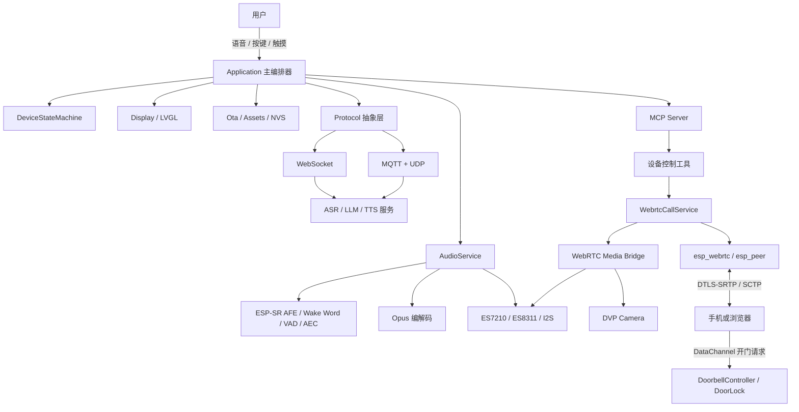
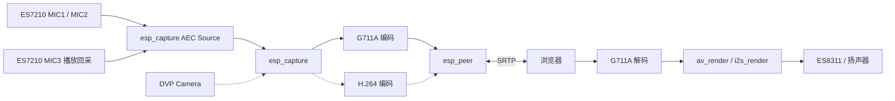
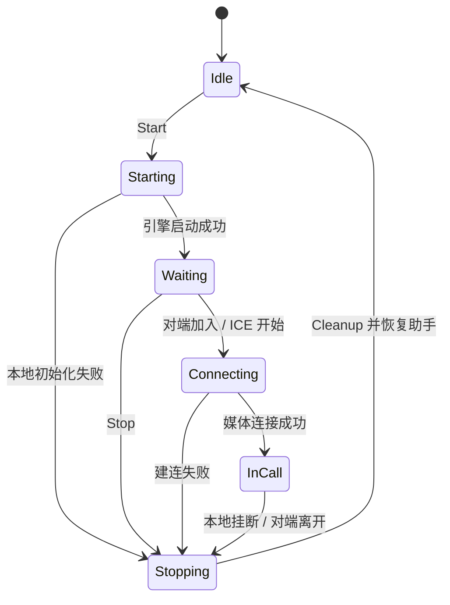

# 基于 ESP32-S3 的智能音箱：语音助手、WebRTC 实时通话与远程门锁

> 面向岗位：嵌入式软件工程师、物联网开发工程师、智能硬件工程师、音视频/实时通信方向

## 1. 项目概述

本项目是一套运行在 **ESP32-S3** 上的智能音箱固件。设备以离线唤醒词为入口，通过流式 ASR、LLM 和 TTS 完成语音交互，并通过 MCP（Model Context Protocol）向大模型暴露设备控制能力。在此基础上，项目新增了一条可独立启停的 **WebRTC 点对点实时通话链路**，支持浏览器与设备进行双向语音通话、设备摄像头单向视频上行，并进一步扩展出门铃界面和基于 WebRTC DataChannel 的远程开门功能。

项目重点不只是“把 WebRTC 跑起来”，而是处理资源受限设备上更实际的工程问题：语音助手与通话链路如何安全复用同一套麦克风、扬声器和摄像头，异常退出后如何保证助手恢复，如何进行设备端回声消除，如何隔离控制消息与不可信信令，以及如何在 16 MB Flash 和有限内存中保持双分区 OTA 能力。

### 一句话定位

在 ESP32-S3 智能音箱上集成离线唤醒、云端语音对话、设备端 AEC、WebRTC 音视频通话、门铃交互和远程门锁控制，并通过状态机、资源独占、条件化依赖和失败恢复机制保证多条实时链路可控切换。

### 核心技术栈

| 类别 | 技术与组件 |
| --- | --- |
| 嵌入式平台 | ESP32-S3、ESP-IDF 5.5.2+、FreeRTOS、C/C++、CMake、Kconfig |
| 音频 | ESP-SR AFE、Opus、G711A/PCMA、esp_codec_dev、esp_capture、av_render、I2S/TDM、AEC/VAD |
| 实时通信 | WebRTC、ICE、DTLS-SRTP、SCTP DataChannel、AppRTC 信令、设备侧 HTTPS/SSE 信令 |
| 网络协议 | WebSocket、MQTT + UDP、HTTP/HTTPS、MCP |
| 图形与交互 | LVGL 9、SPI LCD、触摸屏、门铃状态页、浏览器端原生 JavaScript |
| 设备能力 | NVS 配置持久化、双分区 OTA、资源分区、Wi-Fi 配网、摄像头、GPIO 门锁脉冲 |
| 工程工具 | Python 一致性测试、静态网页模块化、Git、ESP-IDF Component Manager |

---

## 2. 项目来源与个人贡献边界

本项目基于 MIT 许可的开源项目 **xiaozhi-esp32**（项目版本 `2.2.6`）进行二次开发，并非从零实现完整语音助手。求职介绍中应清晰区分上游基座、第三方组件与个人改造，避免把开源能力包装成个人原创。

| 范围 | 主要内容 | 归属说明 |
| --- | --- | --- |
| 上游语音助手基座 | 离线唤醒、云端 ASR/LLM/TTS 对话、基础音频服务、板级驱动、LVGL 显示、OTA、MCP 框架 | 来自 xiaozhi-esp32，项目在其架构上继续开发 |
| WebRTC 底层组件 | `esp_webrtc`、`esp_peer`、`esp_capture`、`av_render`、`media_lib_utils` | 采用 Espressif 组件，仓库内以 vendored 方式管理部分源码和预编译库 |
| 本项目核心改造 | WebRTC 通话服务、媒体桥、状态机、MCP 工具、双信令接入、门铃 UI、DataChannel 远程开门、门锁执行器 | 个人重点设计与集成部分 |
| 音频系统改造 | 暴露并复用 codec handle、语音助手与 WebRTC 的 Suspend/Resume、MMR 硬件参考 AEC、G711A 8 kHz 双工切换 | 个人对上游音频生命周期的增量改造 |
| 并发与交互增强 | 主任务事件串行化、状态机副作用集中处理、TTS 播放期间 AEC + VAD 延迟确认打断 | 当前工作区的进一步改造 |
| 工程化工作 | ESP32-S3 双板收敛、条件化依赖、16 MB 分区调整、板级配置一致性测试、浏览器端模块化 | 为降低构建复杂度和回归风险所做的工程治理 |

### 适合在简历中强调的个人价值

- 不是简单调用 WebRTC API，而是完成了实时音频链路、板级硬件和既有语音业务之间的系统集成。
- 能够从资源所有权、线程上下文、状态恢复和安全边界出发分析嵌入式系统，而不是只关注正常路径。
- 对尚未完成实机验证的能力明确标注，不使用没有测试依据的性能数据。

---

## 3. 硬件平台

项目当前收敛到两块 ESP32-S3 开发板，均使用 16 MB Flash 和 PSRAM，默认音频采样率为 24 kHz。

| 能力 | 立创 ESP32-S3 开发板 | ESP-BOX-3 |
| --- | --- | --- |
| 显示 | 320 × 240 ST7789 LCD，支持 FT5x06 触摸 | 320 × 240 ILI9341 LCD |
| 音频 | ES8311 播放 + ES7210 多通道采集 | ES8311 播放 + ES7210 多通道采集 |
| 摄像头 | DVP 摄像头，QVGA RGB565 | 无摄像头，WebRTC 自动降级为纯音频 |
| 助手音频 | 24 kHz | 24 kHz |
| WebRTC 音频 | G711A，8 kHz，单声道，全双工 | G711A，8 kHz，单声道，全双工 |
| WebRTC 视频 | H.264，320 × 240，15 fps，仅上行 | 不启用视频 |
| 门锁控制 | GPIO21 输出 800 ms 高电平脉冲 | 未声明门锁 GPIO，安全地保持不可用 |

门锁 GPIO 只输出逻辑控制信号，不能直接驱动电锁或继电器线圈。实际硬件需要继电器、MOSFET 或三极管驱动，并配置续流保护和外部下拉电阻。

---

## 4. 功能组成

### 4.1 智能语音助手

- 使用 ESP-SR 完成离线唤醒词检测和本地 AFE 处理。
- 通过 WebSocket 或 MQTT + UDP 与服务端建立语音会话。
- 上行音频使用 Opus 编码，下行 TTS 音频解码后送入扬声器。
- 支持自动停止、手动停止和实时监听三种会话模式。
- 支持设备端 AEC、服务端 AEC 或关闭 AEC，并在协议握手中声明对应能力。
- 通过 MCP 将设备控制能力注册为模型可调用工具。
- 支持 NVS 配置保存、设备激活、资源更新、版本检查和双分区 OTA。

### 4.2 自由打断

当前工作区增加了 TTS 播放期间的自由打断能力：

1. 设备进入 `Speaking` 状态后，不再把普通语音处理结果上传，而是仅运行 AEC + VAD。
2. VAD 检测到人声时启动一次性确认定时器，默认确认时间为 200 ms。
3. 定时器到期后再次检查设备状态和 VAD 状态，过滤短促噪声与残余扬声器回声。
4. 确认是用户讲话后中止服务端 TTS，清空本地下行播放缓存和旧的上行音频。
5. 状态机切回 `Listening`，继续采集用户当前语句。
6. 若板卡没有可靠的播放参考通道，则回退到原有的唤醒词打断方式。

这一设计避免了“听到任意瞬时声音就打断”的问题，也避免在检测阶段把回声或无效 PCM 上传到服务端。

### 4.3 WebRTC 实时通话

- WebRTC 功能由 `CONFIG_USE_WEBRTC_CALL` 编译期开关控制，默认关闭。
- 手机或浏览器与 ESP32-S3 建立点对点媒体连接，不经过中心媒体服务器转发。
- 音频采用 G711A/PCMA 8 kHz 单声道双向传输。
- 立创板支持 H.264 320 × 240、15 fps 的设备到浏览器单向视频。
- ESP-BOX-3 在运行时检测不到摄像头时自动降级为纯音频通话。
- 禁用引擎自动重连，对端离线后由应用层统一清理资源并恢复语音助手。
- 提供通话状态、建连阶段耗时、通话时长和结束原因统计。

### 4.4 门铃与远程开门

- LVGL 门铃页面提供呼叫、开门提示和房间号设置等交互。
- 房间号存入 NVS，并在外部 AppRTC 信令模式下参与信令地址拼接。
- 浏览器端页面位于 [`web/doorbell/`](web/doorbell/)，使用原生 ES 模块拆分应用、信令、PeerConnection、门锁协议与日志职责。
- 远程开门命令只接受已经完成 WebRTC 握手的 DataChannel 消息。
- 设备使用 `request_id` 关联请求和应答；浏览器超时只显示“结果未知”，不会自动重发物理动作。
- 门锁忙时不重新计时，退出门铃、停止服务或发生错误时都会强制恢复无效电平。

---

## 5. 系统架构

### 5.1 整体架构



### 5.2 语音助手链路

```text
麦克风
  → AudioService 输入任务
  → ESP-SR AFE / 唤醒词 / AEC / VAD
  → Opus 编码任务
  → WebSocket 或 MQTT+UDP
  → 云端 ASR → LLM → TTS
  → Opus 下行包
  → 解码与播放队列
  → ES8311 → 扬声器
```

`AudioService` 内部把采集、播放和 Opus 编解码拆为独立 FreeRTOS 任务，并通过队列转移音频包所有权。`Application` 不直接处理音频算法，而是根据全局状态决定何时启停语音处理、唤醒词、解码器和网络音频通道。

### 5.3 WebRTC 媒体链路



立创板的 ES7210 使用四时隙 TDM，其中 MIC1、MIC2 采集近端语音，MIC3 接收 ES8311 播放回采，AFE 布局为 `MMR`，有效通道掩码为 `0x07`。AEC 输出单声道 PCM 后再进入 G711A 编码。静音阶段仍连续送帧，避免用户开口时首段语音被 VAD 截断。

---

## 6. 软件架构与核心模块

| 模块 | 主要职责 | 关键设计 |
| --- | --- | --- |
| `Application` | 整机生命周期和业务编排 | 事件组汇聚跨任务事件，复杂状态修改回到主任务串行执行 |
| `DeviceStateMachine` | 管理 Starting、Idle、Listening、Speaking、Upgrading 等状态 | 先校验合法跳转，再由 `Application` 统一执行 UI、音频和网络副作用 |
| `AudioService` | 采集、播放、AFE、唤醒、Opus 编解码和跨任务队列 | 将实时音频任务与业务状态解耦，支持 Suspend/Resume 和打断检测 |
| `Protocol` | 统一云端语音会话接口 | WebSocket 与 MQTT + UDP 对上层暴露一致的会话和音频语义 |
| `McpServer` | 注册大模型可调用工具 | 将系统、通话和门铃能力映射为受控接口 |
| `WebrtcCallService` | WebRTC 生命周期、状态机、信令、统计 | 失败路径统一进入幂等 Cleanup，关闭自动重连 |
| `webrtc_media_bridge` | 连接既有 codec、esp_capture、av_render 和摄像头 | 复用已初始化句柄，避免重复初始化 I2S |
| `DoorbellController` | UI、房间配置和控制协议 | 将消息来源通道作为授权判断的一部分 |
| `DoorLock` | 输出定长 GPIO 脉冲 | 固定引脚、有效电平和脉冲宽度，不提供通用 GPIO 写接口 |
| `Ota` | 版本检查、激活信息解析和固件写入 | 写入非活动 OTA 槽，校验成功后才切换启动分区 |

### 主任务并发模型

网络、音频、定时器和 WebRTC 回调可能运行在不同 FreeRTOS 任务中。项目采用两类方式把工作交还给主任务：

- 无参数的高频状态变化使用 EventGroup 事件位通知。
- 需要携带数据或保证逐项执行的操作放入 `main_tasks_` 闭包队列。

主循环被唤醒后批量消费事件，并在单一任务中修改状态机、协议对象生命周期和大部分 UI。这样能够减少回调线程直接操作共享业务对象导致的竞态，同时保留实时音频任务的独立性。

---

## 7. 关键技术难点与解决方案

### 7.1 同一套音频硬件被两条链路争用

语音助手已经初始化并占用了 ES7210、ES8311 和 I2S，而 WebRTC 的采集、渲染同样需要这些外设。若再次初始化 codec 或 I2S，会产生驱动冲突、采样时钟不一致或不可预测的音频异常。

解决方式是给音频抽象暴露既有 `esp_codec_dev_handle_t`，让 WebRTC 媒体桥复用助手已经创建好的录音和播放 handle。通话开始时按顺序执行：

```text
暂停助手音频任务
  → 挂起助手对话
  → 释放摄像头
  → 构建 WebRTC 媒体桥
  → 启动 PeerConnection
```

结束或任一步失败时统一执行相反方向的清理，恢复摄像头、24 kHz 助手音频和语音会话能力。`Cleanup()` 被设计为幂等，避免多个异步结束事件造成重复释放。

### 7.2 通话期间的设备端回声消除

WebRTC 通话切换到 G711A 8 kHz 后，原助手 AFE 不再直接承担通话处理。项目为 WebRTC 媒体桥创建独立的 `esp_capture` AEC 音源，并使用 ES7210 的 MMR 硬件参考布局：两个近端麦克风通道加一路实际播放回采。

播放参考覆盖解码、增益、DAC 和前级功放带来的变化，比只在软件中复制待播放 PCM 更接近真实回声路径。声明硬件参考能力的板型若无法创建 AEC 音源，会直接让通话启动失败，不静默退化为强回声的裸麦克风链路。

### 7.3 TTS 播放过程中的人声打断

仅依赖单次 VAD 翻转容易被扬声器残余回声和瞬时噪声误触发。项目在 `Speaking` 状态下采用“持续 AEC + VAD、关闭上行编码、延迟二次确认”的策略：首次检测到人声后等待配置时长，再同时核对状态机和 VAD。只有条件仍成立才中止 TTS、清空缓存并切回监听。

这个设计体现了实时音频中的两点取舍：既要缩短用户打断延迟，又不能因为短促噪声频繁打断播报；既要持续分析麦克风，又不能把检测阶段的回声数据误上传。

### 7.4 依赖版本冲突与默认功能零回归

上游助手和 WebRTC 组件依赖不同版本的 `esp_audio_codec`、`esp_audio_effects` 与 `esp-sr`。如果直接整体升级，会让 WebRTC 关闭时的默认构建也发生变化。

项目使用 Component Manager 的 `matches` 根据 `CONFIG_USE_WEBRTC_CALL` 条件选择版本，并把 vendored WebRTC 组件放在不会被 ESP-IDF 自动发现的 `esp-webrtc/` 目录，仅在功能开启时通过 `override_path` 拉入依赖图。这样把实验性功能的影响限制在开启态。

### 7.5 固件体积与双分区 OTA

加入 WebRTC 后应用镜像需要更大的 OTA 槽。项目重新分配 16 MB Flash：`ota_0` 和 `ota_1` 各扩展到 `0x410000`，资源分区调整为 `0x7c0000`，仍然保留双应用槽和独立资源分区。

升级时固件写入非活动分区，完成镜像校验后才设置下次启动分区；新镜像完成关键启动链路后再取消 Bootloader 的待验证状态。任一步失败均保持当前运行分区不变。

### 7.6 WebRTC 建连状态和可观测性

项目将“等待对端”和“ICE 建连”拆成不同状态，区分没人加入与已经配对但连接失败。`self.video_call.get_stats` 返回：

- `wait_ms`：等待对端出现的时间；
- `ice_ms`：ICE/NAT 穿透阶段时间；
- `setup_ms`：从受理到媒体连通的总时间；
- `talk_ms`：通话持续时间；
- `last_end_reason`：本地挂断、启动失败、建连失败或对端离线；
- 会话次数及不同结果的累计计数。

计时和计数使用 32 位原子量，避免 Xtensa 上 64 位原子可能引入额外锁和辅助库。组件未向应用层暴露 RTCP 统计，因此项目没有虚构 RTT、抖动和丢包率数据。

### 7.7 远程开门的信任边界

信令通道的职责是交换 SDP 和 ICE，不应自然获得控制物理门锁的权限。公网房间号可能被猜中，本地设备信令端点目前也没有身份认证。因此项目将“消息来自哪条通道”一路传递到门铃业务层：

- `ring` 等普通通知允许在 DataChannel 未建立时回退到信令通道；
- `open_door` 只接受通话建立后的 DataChannel 消息；
- 来自信令通道的同名开门请求直接丢弃且不返回确认；
- 门锁接口只允许“执行一次定长脉冲”，不暴露任意 GPIO 操作；
- 脉冲执行期间再次请求返回 busy，不延长开锁时间；
- 定时器回调只恢复 GPIO 电平，不在高优先级定时器任务中阻塞。

DataChannel 能保证命令来自完成 DTLS/SCTP 握手的对端，但不能解决“谁有资格成为对端”的身份认证问题。因此本地信令仅适合受控局域网中的开发和演示，不应直接作为生产门禁方案。

---

## 8. 状态机设计

### 8.1 语音助手状态

主要状态包括：

```text
Starting → WifiConfiguring / Activating → Idle
Idle → Connecting → Listening ↔ Speaking
任意受控状态 → Upgrading / AudioTesting / FatalError
```

`DeviceStateMachine` 只负责判断状态跳转是否合法，`Application::OnStateChanged()` 负责真正的副作用，例如刷新显示和 LED、启停语音处理、切换唤醒词和清理解码器。将“规则”和“动作”分开，可以避免不同事件入口各自实现一套不一致的状态切换逻辑。

### 8.2 WebRTC 通话状态



关闭自动重连后，PeerConnection 断开会立即回到清理流程。这样不会让设备在网络异常后长期占用麦克风和扬声器，也避免语音助手一直保持挂起状态。

---

## 9. 信令与浏览器端设计

项目提供两种编译期二选一的信令方式：

| 模式 | 连接方式 | 适用场景 | 安全边界 |
| --- | --- | --- | --- |
| 外部 AppRTC WebSocket | 设备和浏览器加入同一房间 | 跨网络演示与远程连接 | 房间号是当前主要接入门槛，不应通过 MCP 或日志泄露 |
| 设备本地 HTTPS | 浏览器访问设备内置调试页面，通过 HTTPS + SSE/POST 交换信令 | 受控局域网开发调试 | 当前没有鉴权，同网设备可能成为对端，不适合生产门禁 |

外部模式使用 [`web/doorbell/index.html`](web/doorbell/index.html) 作为独立静态页面；本地模式使用固件内嵌的 [`main/webrtc/signaling/http_local/webrtc_test.html`](main/webrtc/signaling/http_local/webrtc_test.html)。本地模式要求开发者自行生成自签证书，证书和私钥被排除在版本库之外。

浏览器端遵循以下约束：

- 不把房间号等接入凭据写入 `localStorage`；
- 日志不输出 SDP、ICE、凭据和控制消息正文；
- 使用 CSP 限制外部资源加载；
- 开门按钮仅在 DataChannel 真正打开后可用；
- 超时不自动重发，避免一次用户操作触发两次物理动作。

---

## 10. 工程化设计

### 编译期隔离

- WebRTC 总开关默认关闭，减少对基础语音助手的影响。
- 视频、门铃和信令方式均通过 Kconfig 配置。
- 门铃全屏界面与表情动画风格互斥，避免两个模块争用同一显示区域。
- 无摄像头板卡在运行时自动降级，不需要维护独立的纯音频代码分支。

### 板级收敛

项目将演示范围收敛到 `lichuang-dev` 和 `esp-box-3`，中文资源固定为 `zh-CN`，目标芯片固定为 ESP32-S3，并把已裁撤板型的旧模块移到 `main/boards/common/legacy/`，防止继续进入默认构建。

[`scripts/test_board_config_consistency.py`](scripts/test_board_config_consistency.py) 自动检查：

- Kconfig 只暴露受支持板型；
- CMake 不再引用已删除板型；
- 板级源码和发布配置是否齐全；
- 语言、芯片目标和分区文件是否收敛；
- CMake 显式列出的源码是否真实存在；
- 已归档模块不会重新进入活动目录。

### 敏感信息保护

- 信令地址的配置说明明确禁止写入凭据。
- MCP 返回的通话信息不包含房间号或其他可直接接入的凭据。
- 获取 TURN 配置时不在日志中输出用户名和密码。
- 本地 HTTPS 私钥只在本机生成，不进入 Git 仓库。

---

## 11. 构建与运行

### 环境要求

- ESP-IDF `>= 5.5.2`
- ESP32-S3 开发环境
- 16 MB Flash 和 PSRAM
- Python 3
- 使用 WebRTC 本地 HTTPS 信令时，需要本地生成测试证书

### 基础构建

```bash
idf.py set-target esp32s3
idf.py menuconfig
idf.py build
idf.py flash monitor
```

在 `menuconfig` 中选择目标板，并根据需要配置：

| Kconfig | 默认值 | 作用 |
| --- | --- | --- |
| `USE_WEBRTC_CALL` | `n` | WebRTC 总开关，需要 ESP32-S3 和 PSRAM |
| `WEBRTC_SIGNALING_APPRTC_WS` | 默认选中 | 使用外部 AppRTC 兼容信令 |
| `WEBRTC_SIGNALING_LOCAL_HTTP` | `n` | 使用设备侧本地 HTTPS 信令 |
| `WEBRTC_CALL_ENABLE_VIDEO` | `y` | 开启摄像头视频上行，无摄像头时自动降级 |
| `WEBRTC_DOORBELL_MODE` | `n` | 开启门铃 UI 与远程开门 |
| `ENABLE_VAD_BARGE_IN` | `y`（满足依赖时） | 播放 TTS 时通过 AEC + VAD 检测用户打断 |
| `VAD_BARGE_IN_CONFIRM_MS` | `200` | 打断前持续人声确认时间 |
| `USE_DEVICE_AEC` | `n` | 使用设备侧 AEC |

### 当前可执行的轻量检查

```bash
python -B scripts/test_board_config_consistency.py
node --check web/doorbell/js/app.js
```

---

## 12. 验证情况与事实边界

### 当前工作区已复验

- 板级与构建配置一致性测试共 **12 项**，全部通过。
- `web/doorbell/js/` 下全部 JavaScript 文件通过 `node --check` 语法检查。
- 文档中的板型、Kconfig、采样率、编码格式、视频方向、门锁 GPIO 和分区信息均按当前源码核对。

### 仓库历史中已有实机记录

- 立创板配合本地信令曾跑通浏览器与设备双向音频和设备摄像头视频上行。
- ESP-BOX-3 曾验证无摄像头时可降级为纯音频。
- 旧版本通话结束后，语音助手的唤醒和对话能力能够恢复。

### 当前版本仍需验证

- 当前工作区包含新的 TTS 自由打断和协议生命周期调整，尚未在本次任务中执行完整 ESP-IDF 编译。
- WebRTC 设备端 MMR AEC、G711A 8 kHz 时钟切换和退出后的 24 kHz 恢复尚需重新上板验证。
- 远程开门的数据通道协议、GPIO21 脉冲和浏览器应答尚未完成端到端联调。
- 本地 HTTPS 信令恢复后的 CMake/Kconfig 组合仍需完整编译和实机复测。
- 公网 AppRTC 信令路径缺少当前版本的硬件跑通记录。
- AEC 收敛效果、回声抑制量、建连延迟、丢包率和长时间稳定性均没有可靠实测数据，因此不在项目介绍中填写虚构指标。

---

## 13. 已知不足与后续优化

| 问题 | 当前情况 | 后续方案 |
| --- | --- | --- |
| WebRTC 链路尚未完成当前版本全量实机回归 | 源码接入和轻量检查已完成 | 两板分别执行默认态、WebRTC 音频态、视频态和门铃态的构建/烧录矩阵 |
| AEC 效果缺少量化结果 | 已接入硬件参考与 AEC 音源 | 使用示波器和录音样本验证参考电平、双讲、收敛时间和长时间时钟漂移 |
| `AudioService::Suspend()` 的退出同步仍可加强 | 当前依赖任务停止流程 | 增加任务已退出的事件确认，替代固定等待或隐式时序假设 |
| 通话期间语音 MCP 控制可能不可达 | 助手对话挂起会影响承载 MCP 的连接 | 将控制通道与语音会话通道解耦，保留通话中的可靠控制面 |
| 本地信令无鉴权 | 只适合受控局域网调试 | 增加一次性凭据、会话鉴权、重放防护和过期策略 |
| 缺少 RTCP 网络质量指标 | 底层组件没有向上暴露 | 扩展 esp_webrtc 接口或在 RTP 层统计序列号、抖动和往返时间 |
| 门锁只完成软件侧安全约束 | 尚未做电气和实物锁验证 | 增加隔离驱动、续流保护、外部下拉和上电默认态测试 |

---

## 14. 目录结构

```text
intelligent_audio_box/
├── main/
│   ├── application.{h,cc}           # 整机编排、主事件循环和状态副作用
│   ├── device_state_machine.{h,cc}  # 语音助手全局状态机
│   ├── audio/                       # codec、AFE、唤醒、VAD、Opus 和音频任务
│   ├── protocols/                   # WebSocket 与 MQTT + UDP 协议实现
│   ├── display/                     # LVGL、LCD 和表情显示
│   ├── boards/                      # 两块 ESP32-S3 板级实现
│   ├── webrtc/
│   │   ├── webrtc_call_service.*   # WebRTC 生命周期、状态与统计
│   │   ├── webrtc_media_bridge.*   # codec/capture/render/camera 媒体桥
│   │   ├── webrtc_mcp_tools.*      # MCP 通话与门铃工具
│   │   ├── signaling/http_local/   # 本地 HTTPS 信令和内置调试页
│   │   └── doorbell/               # 门铃 UI、控制器和门锁执行器
│   ├── ota.{h,cc}                  # 版本检查和双分区 OTA
│   └── Kconfig.projbuild           # 板型和功能开关
├── esp-webrtc/                     # 条件化引入的 Espressif WebRTC 组件
├── web/doorbell/                   # 外部信令模式下的浏览器端页面
├── partitions/v2/16m.csv          # 16 MB 双 OTA 分区布局
├── scripts/                        # 资源生成、调试和一致性测试工具
└── sdkconfig.defaults*             # ESP32-S3 默认配置
```

---

## 15. 面试表达建议

### 30 秒项目介绍

我基于 xiaozhi-esp32 做了一套 ESP32-S3 智能音箱，保留离线唤醒和云端 ASR、LLM、TTS 对话，并重点集成了独立的 WebRTC 实时通话和门铃远程开门能力。项目难点是助手和 WebRTC 要复用同一套音频 codec、I2S 和摄像头，所以我设计了 Suspend/Resume 的独占移交流程和统一失败恢复；音频侧使用 ES7210 的 MMR 硬件参考做 AEC，控制侧把 DataChannel 作为远程开门的信任边界，同时通过 Kconfig 条件依赖保证功能关闭时不影响默认构建。

### 2 分钟项目介绍

这个项目不是从零实现语音助手，而是在 xiaozhi-esp32 上做面向 ESP32-S3 的二次开发。我把支持范围收敛到立创板和 ESP-BOX-3，在已有离线唤醒、Opus 语音交互、LVGL 和 OTA 的基础上，增加了一条可选的 WebRTC 通话链路。

集成时最大的冲突是两套系统都要使用麦克风、扬声器和摄像头。我没有重复初始化 I2S，而是暴露并复用已有的 codec handle；通话开始前暂停助手音频和会话、释放摄像头，结束或失败后统一走幂等 Cleanup 恢复资源。通话音频固定为 G711A 8 kHz，立创板使用 ES7210 的两个麦克风加一路播放回采做 MMR AEC，视频采用 H.264 QVGA 15 fps 单向上行，无摄像头板自动降级为纯音频。

在门铃模式中，我没有直接相信信令消息。真正驱动 GPIO 的开门命令只接受 WebRTC DataChannel，并使用请求 ID、超时不重试和固定脉冲执行器降低误动作风险。工程上还处理了 WebRTC 与上游音频组件的依赖版本冲突、16 MB Flash 下的双 OTA 分区调整，以及板级配置一致性自动检查。当前源码和轻量测试已经完成，但 AEC 效果、远程开门和当前版本完整固件仍需要继续上板验证，这也是我会在面试中主动说明的边界。

### 简历项目描述

**ESP32-S3 智能音箱与 WebRTC 门铃系统｜C/C++、ESP-IDF、FreeRTOS、WebRTC、LVGL**

- 基于 xiaozhi-esp32 二次开发 ESP32-S3 智能音箱，整合离线唤醒、流式 ASR/LLM/TTS、MCP 设备控制、WebSocket/MQTT+UDP 通信及双分区 OTA，并将硬件范围收敛到两款目标板。
- 集成独立 WebRTC 通话链路，复用既有 `esp_codec_dev` 句柄并设计音频/摄像头独占移交与幂等恢复流程，实现 G711A 双向音频、H.264 单向视频和无摄像头自动降级。
- 基于 ES7210 三通道 MMR 硬件参考接入设备端 AEC，并新增 TTS 播放期间 AEC + VAD 延迟确认打断机制，降低扬声器回声和瞬时噪声导致的误打断风险。
- 设计 DataChannel 远程开门协议与定长 GPIO 脉冲执行器，将信令与物理控制权限分离；通过 Kconfig 条件依赖、16 MB 分区重排和 12 项配置一致性测试控制功能回归风险。

### 可能被追问的问题

1. 为什么 WebRTC 通话不用 Opus，而选择 G711A？
2. 为什么不能让助手和 WebRTC 同时操作 I2S？资源所有权如何移交？
3. `Cleanup()` 为什么必须幂等？哪些异步事件可能重复触发结束？
4. MMR 中两个 M 和一个 R 分别是什么？硬件参考为什么优于复制播放 PCM？
5. 自由打断为什么需要 VAD 延迟确认？200 ms 如何继续调优？
6. 为什么远程开门只信任 DataChannel？DataChannel 仍不能解决什么安全问题？
7. 为什么关闭 WebRTC 自动重连？应用层重连有什么优缺点？
8. ESP-IDF 的 `components/` 自动发现为什么会造成关闭态依赖冲突？
9. 16 MB Flash 如何在应用镜像和资源之间取舍？为什么仍保留双 OTA 槽？
10. 当前哪些功能有实机证据，哪些只有源码与静态检查证据？下一步如何设计测试矩阵？

---

## 16. 项目总结

这个项目的价值不在于堆叠功能数量，而在于把语音助手、实时音视频、嵌入式硬件和物理控制整合到一块资源有限的 ESP32-S3 上，并对资源互斥、跨任务状态、失败恢复、依赖隔离、OTA 空间和控制安全进行系统化处理。

从求职角度，它能够展示以下能力：

- 使用 C/C++、ESP-IDF 和 FreeRTOS 进行中型嵌入式项目开发；
- 理解实时音频采集、播放、编解码、AEC、VAD 和多任务队列；
- 能够将 WebRTC 等复杂组件接入既有系统，并处理生命周期和依赖冲突；
- 能够从攻击路径和硬件失效模式设计物理控制边界；
- 能够区分“源码完成”“编译通过”“实机跑通”和“量化验证”，保持技术陈述可追问、可复现。
